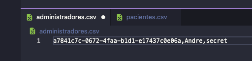

# Evidencia_Computacion_En_Java

## Versión

`1.0.0`

## Instalación y configuración.

Para poder utilizar este programa es necesario descargar el archivo FAT JAR encontrado en la siguiente ubicación del repositorio:

`out/artifacts/Evidencia_Computacion_En_Java_jar/Evidencia_Computacion_En_Java.jar `

Este path está trazado desde el root del repositorio, así que para ejecutarlo el programa solo ingresa al inicio del path la ubicación en tu equipo donde se encuentre el repositorio y ejecútalo con

`-jar <path-to-jar-file>.jar`

O bien, no necesitas descargar todo el repositorio solo el archivo Fat Jar y ejecutarlo con el mismo comando definiendo correctamente el path en tu equipo.

Otro punto importante es asegurarse de que los paths a la base de datos dentro del programa estén correctamente definidos, estos archivos pueden estar vacíos, solamente es necesario que el de los administradores tenga al menos uno registrado para poder hacer login al ejecutar el programa, por ejemplo:

El administrador esta dividido por comas donde el primer valor es cualquier UUID, el segundo es el nombre de usuario y finalmente la contraseña. Es importante utilizar algún usuario o contraseña registrado en este archivo para ingresar al programa.
## Uso del programa.

El propósito de este programa es darle una herramienta a un despacho de doctores donde podrán crear registros de doctores, pacientes y citas asociadas a un doctor y paciente. Todos estos registros serán almacenados en una base de datos a través de la escritura de archivos de texto en el fólder local del repositorio. Con esto, se podrá llevar un control eficaz de todos los registros y se le dará el acceso a los adminsitradores del sistema para crear nuevos registros.

## Créditos

Autor: André Vega

## Licencia

MIT
